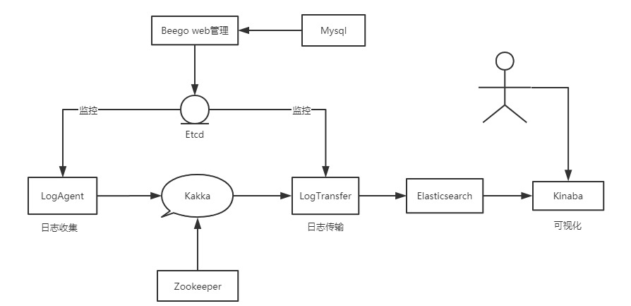

# log_collect

## 简介
go练手项目。适用于熟悉docker和其他常用中间件。 仿照https://github.com/PlutoaCharon/Golang_logCollect编写的日志收集系统。

## 系统架构

logAgent从通过tailf从Etcd中获取要收集的日志信息从业务服务器读取日志信息，发往Kafka

logTransfer负责从Kafka读取日志，写入到Elasticsearch中

通过Kibana进行日志检索

最后通过Web界面控制Etcd管理日志配置

## todo
- [X] 0.Docker安装配置
- [x] 1.Zookeeper,Kafka安装配置
- [ ] 2.LogAgent
- [ ] 3.LogTransfer
- [ ] 4.ES +kinaba
- [ ] 5.Etcd
- [ ] 6.Beego Web